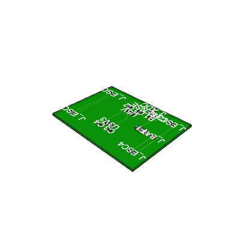
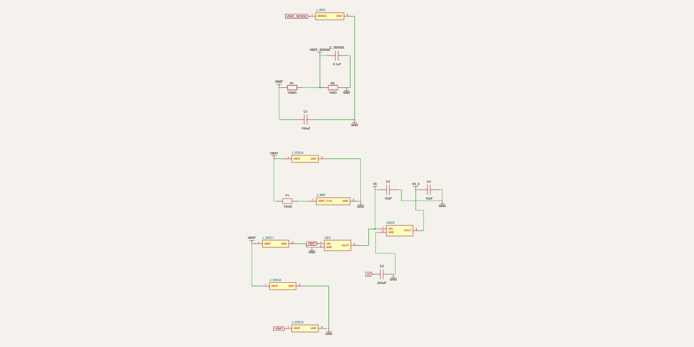

# Drone Power Distribution Board (PDB)

Custom-designed power distribution board for quadcopter drones, created using TSCircuit.

## Overview

This PDB provides clean power distribution for a 4S LiPo-powered quadcopter with integrated voltage regulation and battery monitoring capabilities.

## Features

- **XT60 Battery Input** with fused protection (0.01Ω current sense resistor)
- **4x ESC Power Outputs** for quadcopter motor controllers  
- **5V Buck Regulator** (up to 3A) for flight controller and receiver
- **3.3V LDO Regulator** (up to 1A) for peripheral electronics
- **Battery Voltage Sensing** circuit with 100kΩ/10kΩ divider for ADC monitoring
- **80mm x 60mm** form factor suitable for 5" racing drones

## Specifications

| Parameter | Value |
|-----------|-------|
| Input Voltage | 14.8V - 16.8V (4S LiPo) |
| Max Current (per ESC) | 30A |
| 5V Output | Up to 3A |
| 3.3V Output | Up to 1A |
| Board Dimensions | 80mm x 60mm |

## Design Views

### Schematic

### PCB Layout

### 3D Render

## Circuit Architecture
